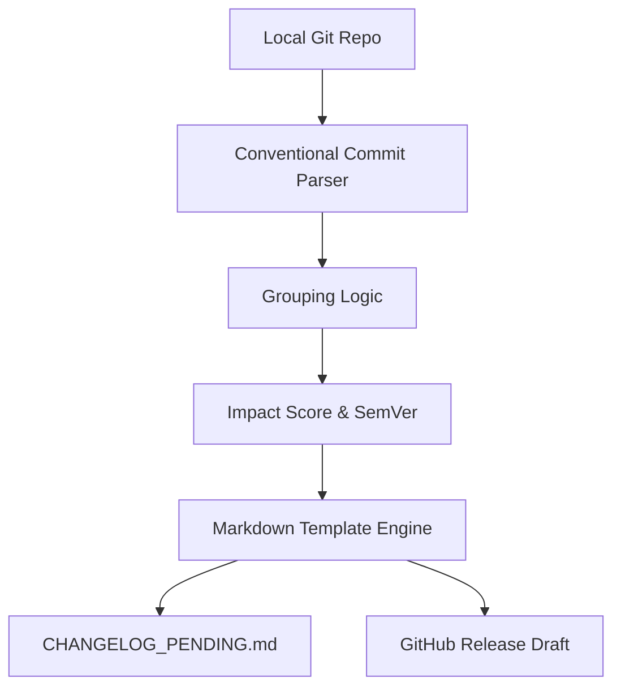

<div align="center">
  <h1>gochangelog-gen</h1>
  <p>Automated changelog generator with Conventional Commits parsing, SemVer suggestions, and GitHub Release integration.</p>

  

  <br>


[](https://goreportcard.com/report/github.com/esousa97/gochangelog-gen)
[](https://www.codefactor.io/repository/github/esousa97/gochangelog-gen)
[](https://pkg.go.dev/github.com/esousa97/gochangelog-gen)


</div>

---

**gochangelog-gen** is a high-performance CLI tool designed to transform Git commit history into professional, human-readable changelogs. By enforcing the **Conventional Commits** specification, it automatically groups changes into logical sections, identifies **Breaking Changes**, suggests the next semantic version (SemVer), and can even create draft releases directly on GitHub.

## Table of Contents

- [Overview](#overview)
- [Features](#features)
- [Tech Stack](#tech-stack)
- [Prerequisites](#prerequisites)
- [Installation](#installation)
- [Quick Start](#quick-start)
- [Configuration](#configuration)
- [Usage Guide](#usage-guide)
- [Testing](#testing)
- [Architecture](#architecture)
- [Release Impact Score](#release-impact-score)
- [Roadmap](#roadmap)
- [Contributing](#contributing)

## Overview

When you run `gochangelog-gen`, it scans your repository's history, parses every commit since the last tag, and produces a structured report. It eliminates the manual toil of tracking what changed, ensuring your users always know exactly what's new:

```text
$ gochangelog-gen generate --suggest-version
2026/04/30 14:00:00 Reading git history from .
2026/04/30 14:00:00 Found 12 commits since v1.1.0
2026/04/30 14:00:00 Grouping: 2 Features, 5 Fixes, 1 Breaking Change
2026/04/30 14:00:00 [Suggestion] Next version should be v2.0.0 (Major)
2026/04/30 14:00:00 Changelog generated: CHANGELOG_PENDING.md
```

## Features

| Feature | Description |
|---------|-------------|
| 🔍 **Git Parser** | Deep integration with `go-git` to iterate and analyze local repository history. |
| 📝 **Conventional Commits** | Regex-based parsing of `type(scope): message` patterns (feat, fix, docs, etc.). |
| 💥 **Breaking Changes** | Automatic detection via `!` suffix or `BREAKING CHANGE:` footer notes. |
| 📂 **Smart Grouping** | Organizes commits into 'Features', 'Bug Fixes', 'Documentation', and more. |
| 🎨 **Template Engine** | Uses Go `text/template` for fully customizable Markdown output. |
| 📈 **SemVer Logic** | Analyzes impact to suggest the next Major, Minor, or Patch version bump. |
| 🚀 **GitHub Integration** | Automated drafting of GitHub Releases via the official REST API. |
| 🔢 **Impact Score** | Unique algorithm to calculate the "weight" of a release based on its contents. |

## Tech Stack

| Technology | Purpose |
|---|---|
| **Go 1.24** | Core language for a single, fast, static binary. |
| **go-git** | Pure Go implementation of Git for repository interaction. |
| **Cobra** | Robust CLI framework for commands and flag management. |
| **GitHub API** | Integration for automated release drafting. |
| **text/template** | Native Go engine for flexible Markdown generation. |

## Prerequisites

- **Go** >= 1.24.0 (for building from source)
- **Git** repository with at least one tag (for history delta calculation)
- *(Optional)* **GITHUB_TOKEN** for creating release drafts

## Installation

### From Source

```bash
git clone https://github.com/esousa97/gochangelog-gen.git
cd gochangelog-gen
go build -o gochangelog-gen ./cmd/gochangelog-gen
./gochangelog-gen --help
```

### Via `go install`

```bash
go install github.com/esousa97/gochangelog-gen/cmd/gochangelog-gen@latest
gochangelog-gen --help
```

## Quick Start

### 1. Generate a Changelog

```bash
gochangelog-gen generate
```
This will create a `CHANGELOG_PENDING.md` in your current directory based on commits since the last tag.

### 2. Get Version Suggestion

```bash
gochangelog-gen generate --suggest-version
# Suggestion: v1.2.0 (Minor)
```

### 3. Draft a GitHub Release

```bash
export GITHUB_TOKEN='your-personal-access-token'
gochangelog-gen generate --github-release
```

## Configuration

### Environment Variables

| Variable | Type | Description |
|---|---|---|
| `GITHUB_TOKEN` | String | Token with `repo` scope to create release drafts. |

### Command-Line Flags

```text
gochangelog-gen generate [flags]

Flags:
  -o, --output string       Output file path (default "CHANGELOG_PENDING.md")
  -t, --template string     Path to a custom .tmpl file
  -s, --suggest-version     Suggest the next SemVer bump
  -r, --github-release      Create a draft release on GitHub
  -v, --verbose             Enable detailed logging
```

## Usage Guide

### 1. Customizing Templates

Create a file named `my_template.tmpl`:
```markdown
## Release {{.Version}} ({{.Date}})
{{range .Sections}}
### {{.Title}}
{{range .Commits}}- {{.Message}} ({{.Hash}}){{end}}
{{end}}
```
Run with:
```bash
gochangelog-gen generate --template my_template.tmpl
```

### 2. Breaking Changes Detection

The tool recognizes breaking changes in two ways:
1. `feat!: change login logic`
2. Message body containing:
   ```text
   feat: change login logic
   
   BREAKING CHANGE: the login endpoint now requires MFA.
   ```
These will be prioritized at the top of your changelog.

## Testing

### Unit Tests
The project maintains high coverage for parsers and logic:
```bash
go test ./... -v
```

### Integration Tests
A full E2E flow testing the CLI and file generation:
```bash
# On Windows
./test_integration.ps1

# General
go test ./cmd/gochangelog-gen/...
```

## Architecture



The codebase is structured for modularity:
- `internal/gitrepo`: Wraps `go-git` operations.
- `internal/parser`: Regex logic for Conventional Commits.
- `internal/changelog`: Orchestrates the generation process.
- `internal/github`: Handles API communication.

## Release Impact Score

To help maintainers understand the "weight" of an update, we use a custom formula:

$$I = (B \cdot 50) + (F \cdot 10) + (X \cdot 1)$$

Where:
- $B$ = Number of **Breaking Changes**.
- $F$ = Number of **New Features**.
- $X$ = Number of **Fixes and Refactors**.

This score is displayed in the generation summary to provide a quick heuristic for the release magnitude.

## Roadmap

### Phase 1 — The Git Parser (Complete)
- [x] `go-git` integration for history traversal.
- [x] Regex-based Conventional Commits parser.
- [x] Basic struct-based commit modeling.

### Phase 2 — Smart Grouping (Complete)
- [x] Categorization into Features, Fixes, Docs, and Refactors.
- [x] "Others" section for non-conventional commits.

### Phase 3 — Breaking Changes (Complete)
- [x] Detection of `!` and `BREAKING CHANGE:` keywords.
- [x] High-priority highlighting in generated logs.

### Phase 4 — Template Engine (Complete)
- [x] `text/template` integration for Markdown.
- [x] Support for external `.tmpl` files.
- [x] Default professional Markdown output.

### Phase 5 — SemVer & GitHub (Complete)
- [x] Logic for Major/Minor/Patch suggestion.
- [x] GitHub API client for automated drafting.
- [x] Implementation of the **Release Impact Score**.

## Contributing

See [CONTRIBUTING.md](./CONTRIBUTING.md) for details on our code of conduct and the process for submitting pull requests.

## License

[MIT License](./LICENSE)

<div align="center">

## Author

**Enoque Sousa**

[](https://www.linkedin.com/in/enoque-sousa-bb89aa168/)
[](https://github.com/esousa97)
[](https://enoquesousa.vercel.app)

**[⬆ Back to Top](#gochangelog-gen)**

Made with ❤️ by [Enoque Sousa](https://github.com/esousa97)

**Project Status:** Study project — feature-complete for Git parsing and Markdown generation

</div>
